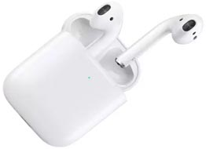
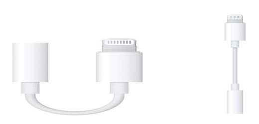
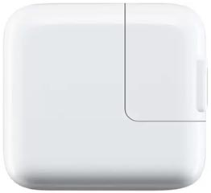
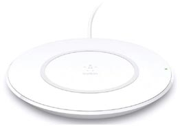

Here you can find the list of top Iphone Accessories which are under Rs.20000. We bring this list based on the review, ratings and specification of the Iphone Accessories. You can get all latest Iphone Accessories complete specification, product description and price details from our website.

### 1.  AirPods with Wireless ChargingCase
 

#### Product Overview

Designed by Apple, The new AirPods complete with Wireless Charging Case and deliver the wireless headphone experience, reimagined. They’re ready to use with your iPhone, Apple Watch, iPad, or Mac once pulled out of the case. The new AirPods automatically on and always connected. Just say “Hey Siri” or setting up double-tap, to adjust the volume, change the song, make a call, or even get directions.Charges quickly in the case and case can be charged either wirelessly using a Qi-compatible charging mat or with the Lightning connector.

#### Key Features

* More magical than ever

 [View complete Details...](#)

### 2. Apple Lightning to 3.5 mm Headphone Jack Adapter
 

#### Product Overview

This adapter connects devices that use a 3.5 mm audio plug to your Lightning devices. Works with all devices that have a Lightning connector and support iOS 10 or later, including iPod touch, iPad, and iPhone.

 [View complete Details...](#)

### 3. Apple 12W USB Power Adapter

#### Product Overview

This compact and convenient USB-based power adapter charges your iPhone, iPad, or iPod with Lightning connector at home, on the road, or whenever it's not connected to a computer. It can be connected directly to your device via the Lightning connector. With a compact design, this power adapter offers fast, efficient charging. 

[View complete Details...](#)

### 4. Apple Pencil (2nd Generation)

#### Product Overview

This 2nd Generation Apple Pencil provides pixel-perfect accuracy and low latency industry-leading, making it great for drawing, sketching, coloring, noting, email marking, and more. Also featuring an intuitive touch surface, the fresh Apple Pencil promotes double-tapping. So now without setting it up, you can alter instruments. Specifically designed for iPad Pro11-inch and iPad Pro 12.9-inch (3rd gene)

[View complete Details...](#)

### 5. Belkin BOOST UP CHARGE Wireless Charging Stand 7.5W

#### Product Overview

With the Boost Up Wireless Charging Pad 7.5W, Unclutter your space and simplify charging. Belkin worked closely with Apple to develop a high-speed, effective charging pad for iPhone XS, iPhone XS Max, iPhone XR, iPhone X, and iPhone 8/8 Plus, providing a quick charging speed of 7.5W when running ios 11.1.2 or later. Just put your phone on and off the pad. You don't have to remove your case, the Boost Up Wireless Charging Pad 7.5W charges up to 3

#### Key Features

* Charge With Confidence
* Premium design
* Fast wireless charging

[View complete Details...](#)

