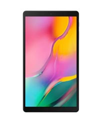
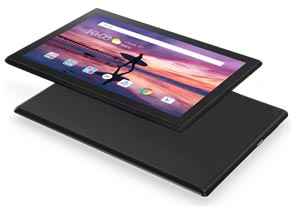
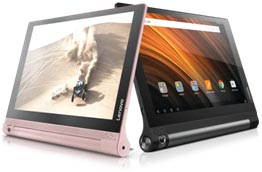
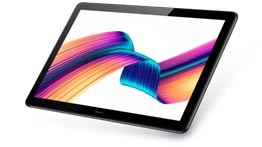

Here you can find the list of top tablets which are under Rs.20000. We bring this list based on the review, ratings and specification of the tablets. You can get all latest tablets complete specification, product description and price details from our website.

### 1. Samsung Galaxy Tab A 10.1  

#### Product Overview

Samsung Galaxy Tab A 10.1 offers you an ultimate viewing experience in 25.54cm (10.1") big screen with narrow bezels by comfortably holding in your hands. And you’ll be surrounded by a true cinematic experience and sound by Dual stereo speakers with Dolby 3D Atmos. Now you can have more fun and fewer breaks with the massive 6,150 mAh battery. Kids love this Tab as they can enjoy fun apps and interactive games in Kids Mode. Parental Control helps you to protect them from potentially harmful content, and limit their screen time as per your choice. Family Group Sharing helps you to Share not just entertainment but also photos, videos, notes, events with the whole family. Switch between apps effortlessly with the powerful processor on the Galaxy Tab A 10.1.

#### Key Features

* BIG ON ENTERTAINMENT
* SUPER SOUND AND POWER
* PORTABLE AND COMFORTABLE
* DESIGNED TO IMPRESS
* MULTITASKING MADE EASY

 [View complete Details...](#)

### 2. LENOVO Tab4 10

#### Product Overview

Tab 4 10 can be a designated kid's tablet by entertaining them to create key presentations,  it’s ideal for the whole family. This stylish Tab 4 10 yet robust device offers seamless performance, a 10.1” display, immersive audio, and great battery life. Watch your favorite TV shows on Amazon, Hulu, or Netflix, With It's vibrant 10.1” HD display and wide-angle views. Delivers a rich, powerful sound, Dolby Atmos® helps to turn the Tab 4 10 into a mobile entertainment hub. With or without headphones enjoy truly immersive audio that flows above and all around you. Tab 4 10 has been engineered for multiple users with distinctive needs. On the same tablet, everyone in a family can have their own account with individual passwords, settings, and social media accounts. Enables super-fast upload, download, and streaming connecting to 4G networks.

#### Key Features

* A tablet for the whole family
* Powerful and seamles
* Audio moves you
* Visual Grabs you
* Ultimate kid-friendly

 [View complete Details...](#)

### 3. LENOVO YOGA TAB 3 10 LTE

#### Product Overview

This ultimate 10.1" video tablet lets you enjoy your favorite shows anytime, anywhere. Designed to deliver great videos and truly immersive audio. Snap pictures like never before using the rotating camera. Scroll through recipes, check your social feeds, and watch movies Immersive audio with its outstanding battery. The two integrated front-facing speakers and powerfully immersive Dolby Atmos® sound give you rich home theater experience. Yoga Tab 3 also comes with a USB ‘On the Go’ powerbank, allowing you to charge other devices. 

#### Key Features

* Ultimate 10.1" video tablet
* Gorgeous display
* Rotatable camera
* Epic battery life

[View complete Details...](#)

### 4. HUAWEI MediaPad T5

#### Product Overview

With a premium, refined design The HUAWEI MediaPad T5 is an eye-catching tablet. Conveniently portable and easy to hold as it is designed with an asymmetrical metal body is crafted with care and lightweight (about 460 g). With a stunning 25.65 cm (10.1") display (1,920 X 1,200 resolution) MediaPad T5 will be a perfect choice for watching movies or TV shows and browsing websites. The octa-core processor consumes less power and gives you great performance. EMUI 8.0 is meticulously designed to deliver the intuitive user experience., without inexplicable pauses, your apps load faster and run.

#### Key Features

* Thin, light, durable
* Stunning 1080p Full HD Display
* Dual Speakers, Immersive Sound
* Powerful Processor, Blistering Performance

[View complete Details...](#)

