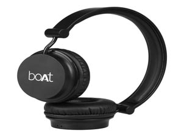
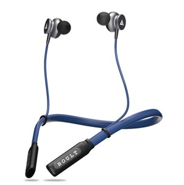
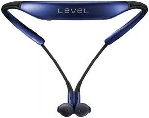
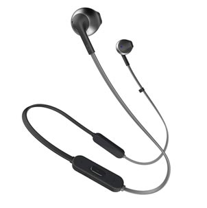
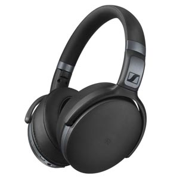

Here you can find the list of top bluetooth headset which are under Rs.10000. We bring this list based on the review, ratings and specification of the headset. You can get all latest bluetooth headset complete specification, product description and price details from our website.

### 1. BoAt Rockerz 400 Wireless Bluetooth Headphones (On the Ear)
 

#### Product Overview

Wired is passé, Stop worrying about wires hanging from here and there. BoAt Rockerz 400 sturdy headset keeping the audio delivery intact, designed to play for up to 8 hours.With the speaker resistance of 32 Ohm, The powerful 40mm dynamic drivers enable the headphones to deliver a punchy, rhythmic response to the most demanding tracks. Feel the rockerz 400 super extra bass at a wide frequency range of 20Hz - 20kHz.The Rockerz 400 is truly the headphones of the future, An ear cup that doubles as a control panel. With a simple click on the buttons just below the ear cup, Now you can pause/play, change tracks, adjust the volume and even answer calls.

#### Key Features

* WEAR YOUR ATTITUDE
* SUPER EXTRA BASS
* EASY CONTROLS

 [View complete Details...](#)

### 2. Boult Audio ProBass Curve Neckband Bluetooth Headset with Mic 

#### Product Overview

Boult Audio ProBass Curve comes with Built-in micro-woofers that produce a deep bass to help you enjoy the music to the fullest. The HD acoustic drivers of Boult Audio ProBass Curve deliver an incredibly detailed high definition audio. The latest Neodymium technology and the CSR8635 Chipset ensure stark connectivity with an 8-meter range and supports 3D acoustics for your favorite music. Enjoy uninterrupted music for up to 10 hours with Strong and flexible neckband with sturdy cables. Attach the two earphones together when not using them. Wear Strong and flexible neckband with sturdy cables like a necklace around your neck, a convenient way to protect them from falling and carry.

#### Key Features

* Supreme Acoustics & Advanced engineering
* Durable and Sturdy
* Don’t Compromise, Enjoy all day!
* Unique Magnetic Design

 [View complete Details...](#)

### 3. Samsung Level U (In the Ear)

#### Product Overview

With sophisticated design and fashionable, striking colors Samsung LEVEL U is built with soft, flexible urethane joints. The LEVEL U Wireless’s neckband-type design offers exceptional wearing comfort. For a perfect and customized fit adjust the neckband, it is compatible with your neck size. Depending on your own needs, The convenient LEVEL APP allows you to customize your listening experience. LEVEL APP also delivers essential information, including missed call alerts, alarms, scheduled events and remaining battery levels through Text-to-Speech (TTS) and vibration alerts. Need not take your paired device Built-in volume, forward/back and play/pause buttons let you enjoy easy access to your LEVEL U Wireless’ functions. 

#### Key Features

* Sophisticated Design
* Comfortable Fit
* More Battery Power

[View complete Details...](#)

### 4. JBL T205BT Bluetooth Headset

#### Product Overview

The JBL TUNE 205BT Bluetooth Earphones with Mic offers a comfortable listening experience on the go. The JBL TUNE 205BT’s highly ergonomic and stylish design fits comfortably around your neck and helps you enjoy your music hustle free. With the convenient three-button remote with microphone, Easily control your sound and manage calls from your headphones. The 6-hour battery life can wirelessly stream JBL Pure Bass sound and provide hands-free calls. A pair of 12.5 mm drivers will punch out some serious bass, while the soft, ergonomically shaped earbuds ensure the listening experience remains comfortable for long listening hours.

#### Key Features

* Hands-free calls
* PURE BASS, ZERO CABLES
* Tangle-Free

[View complete Details...](#)

### 5. Sennheiser HD 4.40-BT Bluetooth Headphones 

#### Product Overview

The new Sennheiser HD 4.40 BT impress you with high-quality wireless sound for every day listening on the move. The closed-back, around-ear headset features Bluetooth 4.0 and aptX compatibility to deliver true Hi-Fi sound with dynamic bass. Crafted from robust, high-quality materials the elegantly designed Sennheiser HD 4.40 BT power your life with music. Calls?change music? or adjust the volume? With the intuitive ear-cup mounted controls and the integrated microphones of the HD 4.40 BT, all this is possible. 

#### Key Features

* Listen to well-matured sound
* Control is all at your fingertips

[View complete Details...](#)

