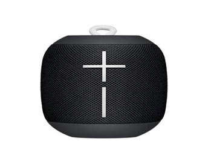
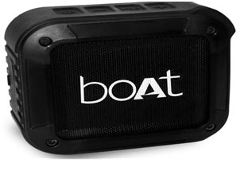
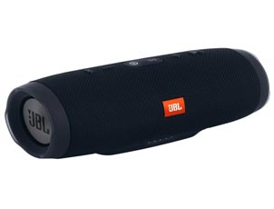
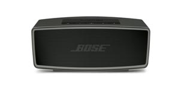

Here you can find the list of top bluetooth speakers which are under Rs.20000. We bring this list based on the review, ratings and specification of the speakers. You can get all latest bluetooth speakers complete specification, product description and price details from our website.

### 1. Ultimate Ears Megaboom 3
 

#### Product Overview

Wrapped in shimmering, high-performance fabric The Ultimate Ears MEGABOOM 3 is a powerful portable wireless speaker with deep thundering bass and immersive 360° Speaker.MEGABOOM 3 which is designed for outdoor use also seriously waterproof, dustproof, and drop-proof to let you take on any adventure. With loud, punchy, strong sound MEGABOOM 3 with an iconic cylindrical design that is pioneering to produce immersive, stereophonic audio that uniformly radiates in all directions 
HEAR AND FEEL 
MEGABOOM 3's extra size and larger woofer create intense bass which helps you to hear and feel your music. With nicely balanced bass, mid and treble tones Magic Button lets you play, pause, and skip streaming music tracks directly on the speaker. 
LEADING BATTERY LIFE 
UE says the speaker can play for 20 hours on a full charge and used the latest battery cell technology powering high-performance electric cars, it will last almost a full day on a single charge.  
Wireless and Setup 
With impressive signal strength, working through several walls indoors.Use PartyUp on the Ultimate Ears app to pair as many as 150 BOOM and MEGABOOM speakers from any generation.

#### Key Features

* RICH DEEP BASS
* WATERPROOF
* BOLD DESIGN
* PARTY UP
* TAP TO PLAY
* APP IS AWESOME

 [View complete Details...](#)

### 2. boAt Stone 200 Portable Bluetooth Speakers 

#### Product Overview

Incorporating the newest ideas and features in design and paired up with technology is the sound of the boAt Stone 200 Wireless Speaker. Stay unplugged as you plug into a wireless system that provides wireless loud music wherever you go. The body is made of long-lasting rubber matt finish which makes it shockproof and provides all-around protection against dust and water.
Bluetooth 4.1 eliminates coordinates its radio with 4G so that there is no overlap and both can do their best. Bluetooth 4.1allows you to define the timeout intervals for your devices for reconnection. This implies that by automatically powering up and down, appliances can better handle their energy and that of the device to which they are connected.
Well-balanced and robust crystal bass and the powerful battery delivers quality music, separated from any mains supply, for up to 8-10 hours and is the perfect companion for you in the park, camping or on the beach. 

#### Key Features

* PORTABLE YET POWERFUL
* WATERPROOF
* HANDS-FREE CALLS AND CONTROLS
* CONNECT AND PLAY

 [View complete Details...](#)

### 3. JBL Charge 3 Powerful Portable Speaker

#### Product Overview

JBL Charge 3 is the unsurpassed, high-powered, can take anywhere Bluetooth speaker with robust stereo sound and a power bank wrapped up With durable fabric and rugged housing. The full-featured waterproof portable speaker takes the party everywhere, poolside or in the rain. Its high-capacity 6,000mAh battery provides 20 hours of playtime and helps you to charge your smartphones and tablets via its USB output. With the press of a button, JBL Charge 3 built-in noise and echo-canceling speakerphone gives you crystal clear calls. Wireless Bluetooth streaming: 3 smartphones or tablets can be connected to the speaker wirelessly and takes turns to play powerful stereo sound. 

#### Key Features

* Wireless bluetooth streaming
* WATERPROOF
* Voice Assistant Integration
* Dual External Bass Radiators
* JBL Connect
* Listen Wirelessly, Charge Endlessly

[View complete Details...](#)

### 4. Bose SoundLink Mini II Wireless Bluetooth Speakers

#### Product Overview

The SoundLink® Mini Bluetooth® speaker II is an ultra-compact with dramatically deeper bass delivers breathtaking sound experience. Makes easy wireless connections anytime, anywhere with a built-in microphone. You need not leave your favorite music behind because it is light enough to fit into your bag. Weighs just 0.68 kilograms.	Its durable design with up to 10 hours of battery life, can keep your playlist going all afternoon. Smartphones and tablets can be paired up with SoundLink® Mini II. It's easier to reconnect as it remembers the last eight devices used. Without wires, you can enjoy all your favorite sounds with a reliable range of about 9 m.With high-efficiency transducers, you have an amazing audio experience.

#### Key Features

* Better sound in the palm of your hand
* Engineered to travel
* Durable design
* High On Performance

[View complete Details...](#)

### 5. Ultimate Ears Wonderboom Bluetooth Speaker 

#### Product Overview

Super-portable Bluetooth® speaker gives a superior quality audio experience. Enjoy 360o sound with balanced bass. It’s truly waterproof With an IPX7 rating withstands 1-meter depth for up to 30 minutes. It allows you to connect up to 100ft (30m) away and seamlessly controls music from across the room without any drop. The Ultimate Ears Amazing Bluetooth connectivity helps you to paired up easily with any smartphones, tablets or smart devices. Packs a loud punch in a tiny rigid body.

#### Key Features

* SURPRISINGLY BIG SOUND
* ASY PLAY, PAUSE, SKIP
* VIRTUALLY INDESTRUCTIBLE

[View complete Details...](#)

