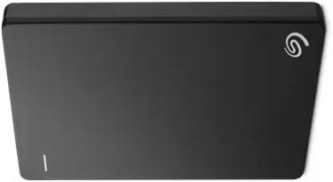

Here you can find the list of top hard disk which are under Rs.20000. We bring this list based on the review, ratings and specification of the hard disk. You can get all latest Hard Drive complete specification, product description and price details from our website.

### 1. WD My Passport 4 TB Wired External Hard Disk Drive
 

#### Product Overview

The most trustworthy, mobile storage that provides you the trust and liberty to move forward in life. There is room to shop, organize, and share your pictures, videos, music, and records with a fresh, stylish design that fits in the palm of your hand. The My Passport drive, perfectly combined with WD BackupTM  software and password security, helps to maintain the contents of your digital life secure.The fresh My Passport has been redesigned and is accessible in a range of vibrant colors to feature a comfortable, slim form factor. 4 TB wired hard drive make sure everything you create while on your own life journey - photos, videos, music, and documents - gets stored. Keep your digital life's contents secure with My Passport password protection and built-in 256-bit AES hardware encryption from unauthorized access.

#### Key Features

* Every journey needs a passport
* Slim style
* Backed up
* Locked down
* Super easy
* Social friendly
* Ongoing confidence

 [View complete Details...](#)

### 2. Seagate Backup Plus Slim 2 TB

#### Product Overview

With this portable hard disk drive from Seagate, protect and share your digital life. Carry your important files with you anywhere, as it is just 12.1 mm thick can easily slip it into your bag and carry it around. Keep your memories safe with this portable hard disk drive from Seagate with up to 2 TB of capacity, store your music, photos, videos and much more. With high-speed USB 3.0 and 2.0 connectivity options, you can connect this portable drive to your computers smoothly.

#### Key Features

* Back Up your Stuff - Anytime, Anywhere
* Easy Manage your Favorites Wherever
* Plug-and-Play High-Speed Connectivity

 [View complete Details...](#)

### 3. Toshiba Canvio Advance

#### Product Overview

The canvio advance portable hard drive offers high storage capacity, 24/7 access to your stored content and the time-tested reliable performance they need. Canvio advance offers the space to create,Whenever and wherever creativity strikes. You can store thousands of pictures, videos, music, or a variety of large files on a small 2.5 inch portable drive. The new Toshiba canvio advance features like password protection and scheduled backup keep your files safe and secure. With usb 3.0 you'll be able to transfer and backup files. 

#### Key Features

* Compact design 
* Fits your lifestyle
* Store your growing files and content

[View complete Details...](#)

### 4. Transcend StoreJet

#### Product Overview

This portable hard drive built to be more resistant to shock than most such products. It's aided by a tough rubberised jacket and internal damper frame.one-touch quick reconnect and one-touch auto-backup buttons allows you to instantly create backups by just pressing the button on the hard drive. Transcend Elite data manager program that has more functions for data management.

#### Key Features

* More Resistant  
* one-touch quick reconnect

[View complete Details...](#)

### 5. Sony 1 TB Wired External Hard Disk Drive
 

#### Product Overview

Save all your business files or personal photos, videos and music, in this Sony 1TB hard disk. Stylishly designed, this external hard disk ensures super-fast transfer speeds of up to 5 GB/s via a 3.0 USB and 480 Mbps via a USB 2.0 making it easy for you to save and transfer files. 

#### Key Features

* Pocket-sized device

[View complete Details...](#)

