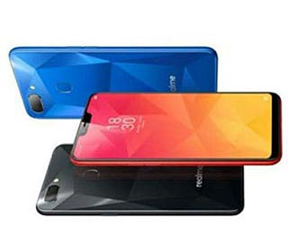

Here you can find the list of top 5 mobiles which are under Rs.10000. We bring this list based on the review, ratings and specification of the mobiles. You can get all latest mobiles complete specification, product description and price details from our website.

### 1. SAMSUNG GALAXY M20

#### Product Overview

A stunning Mid-Range device with 16cm (6.3") infinity V display and edge to edge FHD+ screen give you immersive viewing experience. With the massive 5000 mAh battery gives you 3X faster-charging capability with an in-box 15W Type-C fast charger. Through a single charging, it gives you a  long-lasting battery backup. Ultra-Wide Dual Rear Camera comes with a smart Fast Face Unlock and Fingerprint Sensors. Galaxy M20 with a waterdrop-style notch works quite well with its well designed, The Exynos 7904 processor. Many options such as 4G VoLTE, Wi-Fi 802.11, b/g/n, Mobile Hotspot, Bluetooth, GPS with A-GPS, etc are available for connectivity.

#### Key Features

**I’M INFINITE** 
&#9745; A 16cm (6.3") FHD+ Infinity V Display 
**I’M CHARGED** 
&#9745; 5000mAh Battery and 3x Fast Charge 
**I’M ZIPPY** 
&#9745; new Exynos 7904, 1.8 GHz Octa-Core Processor 
**I’M SOCIAL & FAB** 
&#9745; Ultra-Wide Dual Rear Camera 
**I’M MORE** 
&#9745; 8MP F2.0 Front Camera + In-Display Flash 
**I’M SECURE** 
 &#9745; Fast Face Unlock and Fingerprint Sensor

 [View complete Details...](../samsung-galaxy-m20/)

### 2. REDMI Y2

#### Product Overview

Xiaomi Redmi Y2  is a smartphone with youthful design runs on the Android v8.1  (Oreo) operating system.  Its’s selfie camera designed to capture the best and stylish you.  Powered by Qualcomm® Snapdragon 625 processor with the cutting-edge 14nm technology consumes less power to exhibit high performance. Based on deep learning neural networks Redmi Y2's front camera comes with advanced AI technologies that have been trained to distinguish the person in front and blurs the background. Redmi Y2's rear camera  with12MP + 5MP dual cameras and world-class sensors use 1.25μm large pixels, which allows you to capture crisp images even at night. During video recording, to minimize blurring caused by hand jitters or other unsteady movements, Redmi Y2  features Electronic Image Stabilization (EIS) on the dual rear camera setup.
   

#### Key Features

* Perform more and consume less
* Sleek design to match the stylish you
* Be it day or night, Perfect selfies.

 [View complete Details...](../Redmi-Y2/)

### 3. REALME 2

#### Product Overview

With a Sleek, Shiny, unique design Realme 2 offers long-lasting battery life and smooth user experience. Packed up with  64 GB of internal storage space you have enough space for storing all your pictures, music, and more. This Realme 2 has a glossy finish that reflects light gives you a great experience while streaming videos. Call more, tap more, and play more with your smartphone with expanded battery life(4230mAh - AI Power Master). Access Your Phone at a Glance with Quick Facial & Fingerprint Unlock. The Powerful Processor Snapdragon Octa-core CPU enables you to facilitate multitasking effortlessly. 

#### Key Features

* A Notch Above
* Big Battery -10 hours of gaming
* Shine Like a Diamond
* Two is Better than One - Dual Cameras
* Access Your Phone at a Glance

[View complete Details...](../Realme-2/)

### 4. Asus ZenFone Max Pro M2

#### Product Overview

The ZenFone Max Pro M2 impress you its massive battery, stock Android experience, and powerful performance. The ZenFone Max Pro M2 aims to give you clear and vibrant visual experience on your phone with a 6.26 inch full HD display. You can now preserve your memories with The 5 MP front camera along with dual-LED flash and a 20 MP + 2 MP rear camera. 64 GB of internal storage helps you to store your important files and favorite music. The Asus Zenfone Max smartphone equipped with a Snapdragon 660 Octa processor and a 4000 mAh battery breathes more processing power when you are into visually intense games or shuffling between apps on your phone.

#### Key Features

* Lightweight
* Capture Charming Selfies
* Great low light capabilities
* Immerse yourself in content

[View complete Details...](#)

### 5. NOKIA 5.1 PLUS

#### Product Overview

The high-gloss design, the Nokia 5.1 Plus comes with  5.8’’ (14.88 cm) HD+ display with a 19:9 ratio makes you feel like you’re right there with them, whether you’re watching a movie or video chatting with friends. Nokia 5.1 Plus holds the most advanced chip, The octa-core processor at its heart from MediaTek. With the 13 MP main camera and 8 MP front camera captures a photo as perfect as the moment. It’s easier than ever to explore and capture the world around you with the camera app integrated with Google Lens™ and Motion Photos seamlessly.  The Nokia 5.1 Plus delivers an all-day battery life with a 3060mAh battery easily.

* Polished to perfection
* More power. More fun
* More than just a camera
* secure and up to date
* Access Your Phone at a Glance

