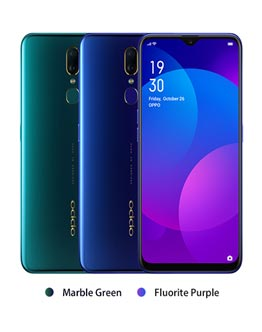

Here you can find the list of top 5 mobiles which are under Rs.20000. We bring this list based on the review, ratings and specification of the mobiles. You can get all latest mobiles complete specification, product description and price details from our website.

### 1. Realme X  

#### Product Overview

Realme X with storage of 128GB offers you an immersive cinematic experience. Powered by 2.2 GHz octa-core Qualcomm SDM710 Snapdragon 710 (10 nm) Processor and a 4GB of RAM, Realme X ensures phone runs smoothly even the most memory intensive applications & still shows no signs of lag. A large 3765 mAh battery supports it's 6.53” screen with IPS display having a resolution of 1080 x 2340 at 394 PPI. Realme X gives you a seamless experience while gaming, surfing or watching movies.

#### Key Features

* Pop Up Generation
* Real cinematic view
* Accelerate Your Gaming Experience
* 3D Design Amaze Your Eyes

 [View complete Details...](#)

### 2. Samsung Galaxy M30

#### Product Overview

The Samsung Galaxy M30’s widescreen with high-resolution gives a nice visual experience. Now you can play your favorite game, music or surf without any disturbance using the robust configuration with a healthy battery back up. Enjoy clicking pictures all through the day with a 13MP + 5MP + 5MP Ultra Wide Triple Rear Camera.16MP front camera of the new Galaxy M30 offers you a picture-perfect selfie experience. Let it be your power-hungry apps or games multitask effortlessly with an all-new 14nm 1.8 GHz Exynos 7904 Octa-Core Processor and the blazing-fast LPDDR4x RAM.

#### Key Features

**I’M SUPER** 
&#9745; 16.21cm (6.4") Super AMOLED FHD+ Infinity U Display 
**I’M CLICKING** 
&#9745; 13MP + 5MP + 5MP Ultra Wide Triple Rear Camera        
* I’M FLAWLESS
* I’M SOCIAL
* I'M BATTLE READY

 [View complete Details...](#)

### 3. Redmi Note 7 Pro

#### Product Overview

The Redmi Note 7 Pro is one of the most feature-packed phones which brings you a premium design, capable octa-core processor, 48-megapixel camera, and fast charging support. The Redmi Note 7 Pro packs a 6.3-inch full-HD+ (1080x2340 pixels) LTPS In-Cell display protected by Gorilla Glass 5 layer. Powered by the Snapdragon 675 processor, alongside 6GB of RAM. The phone captures beautiful images with ample detail, high dynamic range, and good vibrancy with its 48-megapixel main camera. 

#### Key Features

* Dot Notch Display
* Powerful performance
* Flagship-level camera
* All-New Look
* Long battery life

[View complete Details...](#)

### 4. Motorola One Vision

#### Product Overview

Motorola one version comes with big-screen entertainment, Stunning portrait shots, and selfies. With All-day battery plus turbopower™ charging explore your world around you. With monthly security updates ensures protection against online threats. Keeps your device and personal data safe as Security is built into every layer. It responds to your touch in an instant, With 4 GB of memory and a Qualcomm® Snapdragon™ octa-core processor. Along with an in-screen camera, The Motorola One Vision offers a stunning 21:9 CinemaVision Display. Gives you crystal-clear pictures under any lighting condition using an exceptional 48 MP camera system is powered by AI and Quad Pixel Technology.

#### Key Features

* seamless software and app experiences
* Performance powerhouse
* Room for more

[View complete Details...](#)

### 5. OPPO F11 

#### Product Overview

The Oppo F11 comes with all-new symmetrical design features at a mid-range price-tag to make the device a perfect option. Oppo F11 gives you professional photography experience by Combining 48MP+5MP Dual Rear Camera setup, a large image sensor, a large aperture, and AI image processing. Oppo F11 has a robust configuration that functions through the heaviest usage. You’ll experience a smooth performance while playing a game, using an app or switching between multiple apps without slowing down.

* Ultra Night Mode
* VOOC Flash Charge 3.0
* Waterdrop Screen

